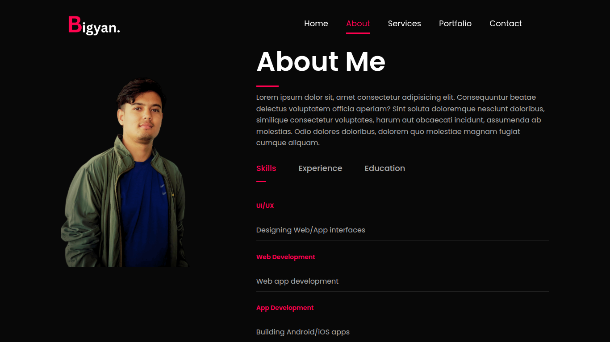
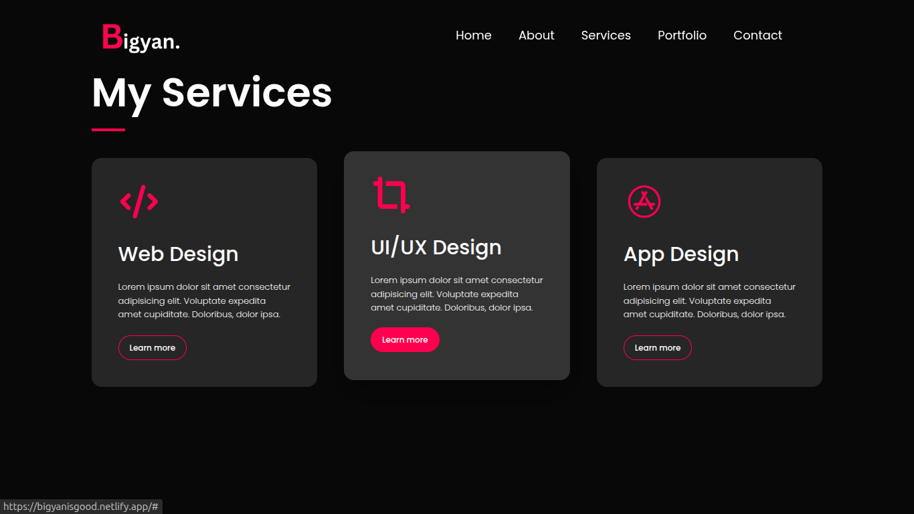

# Bigyan Basnet - Portfolio Website

A modern, responsive portfolio website showcasing UI/UX design and web development skills. Built with clean HTML, CSS, and JavaScript, featuring smooth animations, accessibility features, and mobile-first responsive design.

## 🌟 Features

- **Responsive Design**: Fully responsive layout that works on all devices (desktop, tablet, mobile)
- **Modern UI/UX**: Clean, professional design with smooth animations and transitions
- **Accessibility**: WCAG compliant with proper ARIA labels, keyboard navigation, and screen reader support
- **Interactive Elements**: 
  - Dynamic tab navigation for skills, experience, and education
  - Smooth scrolling navigation
  - Animated portfolio gallery with hover effects
  - Contact form with Google Sheets integration
- **Performance Optimized**: 
  - Optimized images and assets
  - Efficient CSS animations
  - Debounced event handlers
  - Intersection Observer for scroll animations

## 🛠️ Technologies Used

- **HTML5**: Semantic markup with accessibility features
- **CSS3**: 
  - CSS Grid and Flexbox for layout
  - Custom animations and transitions
  - CSS variables for theming
  - Media queries for responsive design
- **Vanilla JavaScript**: 
  - ES6+ features
  - DOM manipulation
  - Form handling and validation
  - Google Sheets API integration
- **Font Awesome**: Icons for enhanced visual appeal
- **Google Fonts**: Poppins font family for typography

## 📱 Responsive Breakpoints

- **Desktop**: 1200px and above
- **Tablet**: 768px - 1199px
- **Mobile Large**: 600px - 767px
- **Mobile Small**: 480px - 599px

## 🎨 Sections

### 1. Header/Hero Section
- Full-screen hero with background image
- Navigation menu with smooth scroll links
- Mobile hamburger menu
- Professional introduction

### 2. About Section
- Personal introduction
- Interactive tabs for Skills, Experience, and Education
- Professional profile image

### 3. Services Section
- Grid layout showcasing services:
  - Web Design
  - UI/UX Design
  - App Design
- Hover effects and animations

### 4. Portfolio Section
- Project showcase with image gallery
- Overlay effects on hover
- Project descriptions and links

### 5. Contact Section
- Contact information with social media links
- Working contact form with Google Sheets integration
- CV download link
- Form validation and error handling

## 🚀 Getting Started

### Prerequisites
- Any modern web browser
- Text editor (VS Code recommended)
- Basic knowledge of HTML, CSS, and JavaScript

### Installation

1. **Clone the repository**
   ```bash
   git clone https://github.com/Bigyanhub/Portfolio_Example.git
   cd Portfolio_Example
   ```

2. **Open the project**
   - Open `index.html` in your preferred browser
   - Or use a local development server like Live Server in VS Code

3. **Customize the content**
   - Replace placeholder content with your own information
   - Update images in the `images/` folder
   - Modify colors and styling in `style.css`
   - Update the Google Sheets form URL in the JavaScript section

## 📁 Project Structure

```
GreatStack_Portfolio/
│
├── index.html                # Main HTML file
├── style.css                 # CSS styles and responsive design
├── README.md                 # Project documentation
│
└── images/
  ├── background.png        # Hero section background
  ├── phone-background.png  # Mobile hero background
  ├── Bigyan.png            # Logo
  ├── user.png              # Profile picture
  ├── work-1.png            # Portfolio project 1
  ├── work-2.png            # Portfolio project 2
  ├── work-3.png            # Portfolio project 3
  ├── my-cv.pdf             # CV/Resume file
  ├── demo_1.png            # Portfolio demo screenshot 1
  ├── demo_2.png            # Portfolio demo screenshot 2
  ├── demo_3.png            # Portfolio demo screenshot 3
  ├── demo_4.png            # Portfolio demo screenshot 4
  └── demo_5.png            # Portfolio demo screenshot 5
```

## ⚙️ Configuration

### Google Sheets Integration
To set up the contact form with Google Sheets:

1. Create a new Google Sheet
2. Set up a Google Apps Script for form submission
3. Replace the `scriptURL` in the JavaScript section with your script URL:
   ```javascript
   const scriptURL = 'YOUR_GOOGLE_SCRIPT_URL_HERE';
   ```

### Customization
- **Colors**: Modify CSS custom properties in `style.css`
- **Fonts**: Change font imports in the HTML head section
- **Content**: Update text content directly in `index.html`
- **Images**: Replace images in the `images/` folder

## 🎯 Browser Support

- Chrome (latest)
- Firefox (latest)
- Safari (latest)
- Edge (latest)
- Mobile browsers (iOS Safari, Chrome Mobile)

## 📊 Performance Features

- **Lazy Loading**: Images load as needed
- **Optimized Animations**: CSS transforms for smooth performance
- **Debounced Events**: Optimized resize and scroll handlers
- **Minimal Dependencies**: Pure vanilla JavaScript implementation

## 🔧 Development

### Local Development
```bash
# Using Python (if available)
python -m http.server 8000

# Using Node.js (if available)
npx http-server

# Using PHP (if available)
php -S localhost:8000
```

### Code Quality
- Semantic HTML structure
- BEM-like CSS methodology
- ESLint compatible JavaScript
- Accessibility best practices

## 📸 Demo Screenshots

Here are some screenshots of the portfolio:






## 🤝 Contributing

1. Fork the repository
2. Create a feature branch (`git checkout -b feature/AmazingFeature`)
3. Commit your changes (`git commit -m 'Add some AmazingFeature'`)
4. Push to the branch (`git push origin feature/AmazingFeature`)
5. Open a Pull Request

## 📄 License

This project is open source and available under the [MIT License](LICENSE).

## 👨‍💻 Author

**Bigyan Basnet**
- Portfolio: [Your Portfolio URL]
- LinkedIn: [Your LinkedIn Profile]
- Email: contact@example.com
- GitHub: [@Bigyanhub](https://github.com/Bigyanhub)

## 🙏 Acknowledgments

- Design inspiration from modern portfolio websites
- Font Awesome for icons
- Google Fonts for typography
- Easy Tutorials for initial guidance

---

⭐ **Star this repository if it helped you build your portfolio!**
